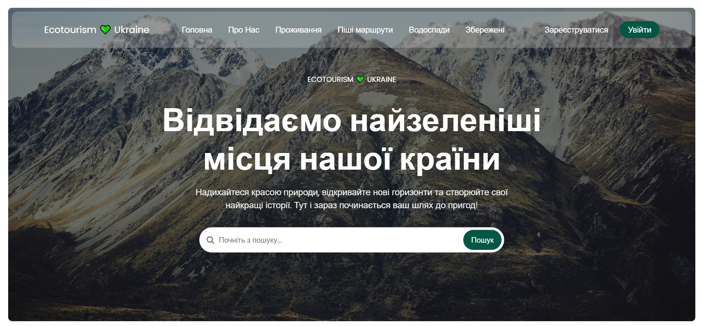
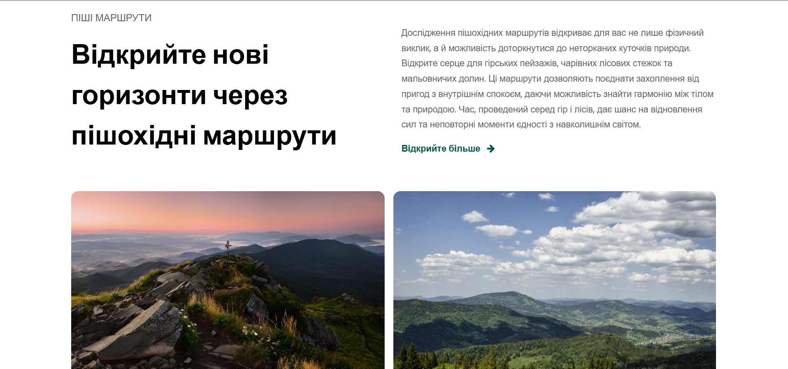
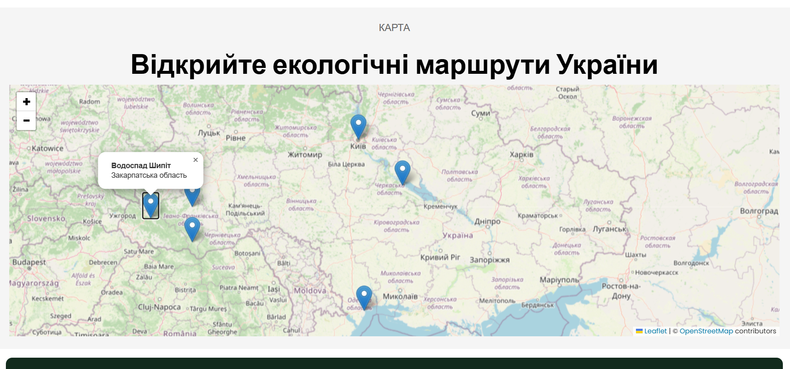

# Ecotourism Website 🌍💚

Welcome to our Ecotourism Website project! This platform is designed to promote sustainable travel, allowing users to explore Ukraine’s beautiful green spaces, including camping sites, hiking routes, and waterfalls. The website offers an intuitive search functionality and a clean, responsive design to make it easy for users to discover eco-friendly travel destinations.

## Website Name: 🌱 Ecotourism 💚 Ukraine

## Technologies Used

1. **HTML**: Structuring the web pages and content, ensuring accessibility and organization.
2. **CSS**: Styling the website to provide a visually appealing and cohesive layout. 
3. **JavaScript**: Enabling dynamic features such as the search function, form handling, and interactivity.
4. **Node.js**: Backend server to handle requests and responses.
5. **MySQL**: Database for storing information about camping sites, routes, and waterfalls.
6. **Express.js**: Used for routing and API creation to serve search results dynamically.

## Usage

1. **Search Locations**: Use the search bar to find camping sites, routes, or waterfalls by name or description.
2. **View Details**: Explore detailed information about the locations, including descriptions, images, and types.
3. **Favorites**: Save your favorite destinations and view them anytime.
4. **Responsive Design**: The site adjusts seamlessly across different devices, from mobile phones to desktops.

## Demo Screenshot





## Explore

➥ [Live Demo](https://yourprojectlink.com)

## How to Run the Project Locally

1. **Clone the Repository**:
   ```bash
   git clone https://github.com/Tania1256/Ecotourism_Ukraine.git